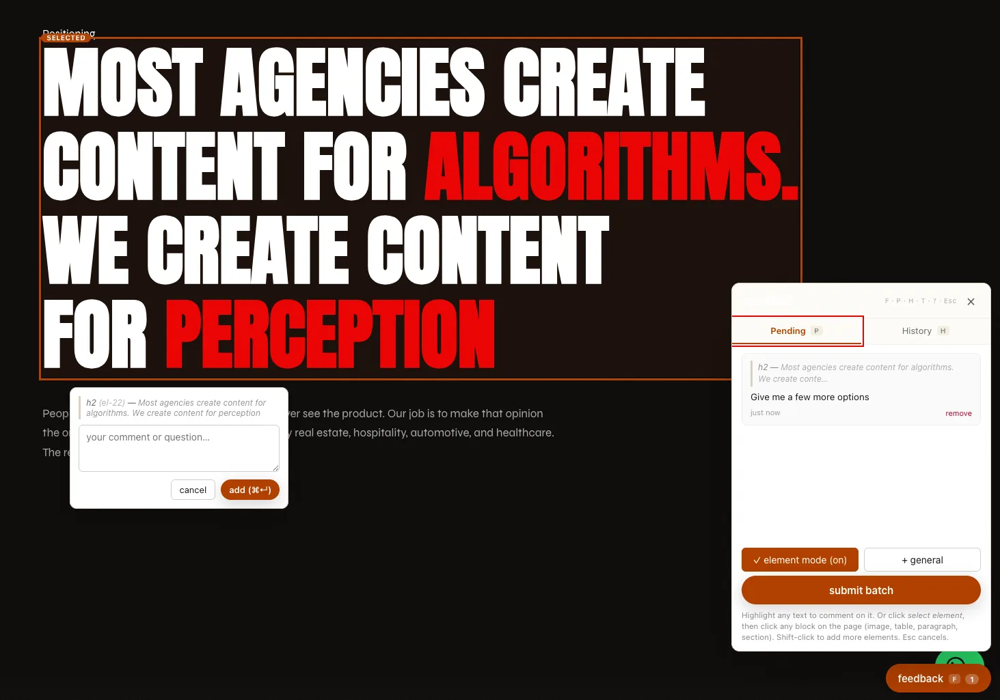

# make-pages-interactive-frameworks

A Claude Code skill that turns a website into a **live in-page commenting surface**.
Highlight text, click an element, or drop a note — the comment lands in a local
inbox that Claude reads and responds to by editing the **source**. The page
reloads with a walkthrough of what changed.



> **This is a fork of [paraschopra/make-pages-interactive](https://github.com/paraschopra/make-pages-interactive).**
> The original works on a folder of plain static HTML (it assumes the file you
> *view* is the file you *edit*). This fork adds **framework mode** so it also
> works on **Eleventy, Astro, and Next.js** projects, where the served HTML is
> throwaway build output and real edits go to source templates. All credit for
> the original design, client library, and server goes to Paras Chopra.

---

## What's different from upstream

| | Upstream | This fork |
|---|---|---|
| Plain static HTML | ✅ | ✅ (unchanged) |
| Eleventy / Astro / Next.js | ❌ | ✅ **framework mode** |
| Injection target | tags written into every `*.html` | static: every page · framework: **one dev-gated block** in the base layout |
| Who serves the pages | the bundled Python server | static: Python server · framework: **your own dev server** (keeps live-reload) |
| Python server role | serves pages **and** feedback API | static: both · framework: **CORS sidecar API** on a separate port |
| Production safety | n/a (static) | framework block is **dev-gated** — never ships to production |

Everything else — the client library, the comment UX, the inbox/history
protocol, the auto-shutting-down server — is from the original.

---

## Recent updates

Element-picker improvements on top of framework mode:

- **Selectable HTML5 landmarks** — `<footer>`, `<header>`, `<nav>`, `<aside>`,
  and `<main>` are now recognised by the picker. Before this, clicking a landmark
  that had no `id` or whitelisted class walked up to `<body>` and selected
  nothing — so footers and nav bars simply couldn't be commented on. Added to
  `COMMENTABLE_TAGS` in [`lib/feedback.js`](lib/feedback.js).
- **Selectable layout containers** — common grid/row wrappers (`three-col`,
  `two-col`, `matrix`, `metrics`, `stats`, `row-list`, `chips`) are now
  commentable, so you can select a whole grid or row as a single unit instead of
  only its child cards. Click a container's gap/padding (not a card) to select it.
  Extend the list in `COMMENTABLE_CLASSES` ([`lib/feedback.js`](lib/feedback.js))
  for your own layout class names.

---

## How it works

**Static mode** (plain HTML) — identical to upstream:

```
user highlights / clicks → feedback.js (in every page) → POST /feedback
   → server.py (stdlib HTTP) → feedback/inbox.jsonl
   → Claude edits HTML, appends feedback/history.json → page reloads with walkthrough
```

**Framework mode** (Eleventy / Astro / Next.js) — dev-server companion:

```
            your framework dev server                Python sidecar (:5050)
          ┌───────────────────────────┐          ┌─────────────────────────┐
 browser →│ renders pages + live-reload│          │ /feedback  (POST)       │
          │ base layout has a          │  CORS    │ /feedback/history.json  │
          │ dev-gated <script          │ ───────▶ │ /lib/feedback.{js,css}  │
          │  data-cf-api=:5050>        │          │ → feedback/inbox.jsonl  │
          └───────────────────────────┘          └───────────┬─────────────┘
                                                              │ Monitor
                                                              ▼
                                                  Claude edits SOURCE templates
                                                  (.njk / .astro / .tsx),
                                                  appends feedback/history.json
```

The key move: inject **once** into the base layout, dev-gated
(`eleventy.env.runMode == "serve"`, `import.meta.env.DEV`, or
`process.env.NODE_ENV === "development"`), so it survives rebuilds and never
reaches production. The framework serves the pages (you keep live-reload); the
Python server runs as a CORS-enabled API sidecar.

---

## Install

```bash
git clone https://github.com/flenard/make-pages-interactive-frameworks \
  ~/.claude/skills/make-pages-interactive
```

Claude Code auto-discovers any folder under `~/.claude/skills/` that contains a
`SKILL.md`. (Clone into a folder named `make-pages-interactive` so the trigger
phrases and docs line up.)

---

## Usage

In any Claude Code session, say:

> "Make this site interactive."

(or "make these pages interactive", "let me comment on this page", "add feedback to these pages")

Claude will detect whether the project is **static** or a **framework** and:

1. Wire it up — static: inject tags into every `*.html`; framework: inject one
   dev-gated block into the base layout (`scripts/inject.py` auto-detects).
2. Create `feedback/inbox.jsonl` + `feedback/history.json`, and add the runtime
   files to `.gitignore`.
3. Start the server(s) — static: the Python server; framework: your dev server
   **plus** the Python sidecar API.
4. Hand you the URL to open (for framework projects, the **framework** dev-server
   URL — not the sidecar port).
5. Monitor the inbox so any comment you leave is picked up immediately.

Comment away. Claude edits the **source** in response. Never edit build output
(`_site/`, `dist/`, `.next/`) — it's wiped on the next build.

### Manual wiring

```bash
# auto-detect (static / eleventy / astro / next)
python ~/.claude/skills/make-pages-interactive/scripts/inject.py ./your-project

# force a mode, or point at a specific base layout / sidecar port
python .../inject.py ./your-project --framework astro --api http://localhost:5052
python .../inject.py ./your-project --framework eleventy --layout src/_layouts/base.njk

# start the sidecar API (framework mode) or full server (static mode)
python ~/.claude/skills/make-pages-interactive/lib/server.py ./your-project --port 5050
```

### Removing it

```bash
python ~/.claude/skills/make-pages-interactive/scripts/inject.py ./your-project --remove
```

Static: strips the tags from every page. Framework: removes the dev-gated block
from the base layout. Idempotent; the round-trip is byte-identical.

---

## Comment types

- **Text selection** — highlight any text, a popup offers "comment".
- **Element selection** — the "select element" tool; click an image, table,
  card, section. Shift-click to add more. Anchored to a stable selector.
- **Page-level** — "+ general" leaves notes not tied to any element.

Comments batch client-side and submit as one POST, so Claude responds to a
coherent set rather than firing per keystroke. Each carries a stable id,
selector, tag, text snippet, and truncated `outerHTML` — enough for Claude to
locate the matching **source** in a framework project.

---

## Repo layout

```
make-pages-interactive-frameworks/
├── SKILL.md          # agent-facing skill spec (static + framework flows)
├── README.md         # this file
├── LICENSE           # MIT (Paras Chopra + framework-mode modifications)
├── lib/
│   ├── feedback.js   # client library; API base read from data-cf-api (forked)
│   ├── feedback.css  # comment UI styles (upstream)
│   └── server.py     # stdlib HTTP server / CORS sidecar API (upstream)
└── scripts/
    ├── inject.py     # framework-aware inject/remove (forked)
    └── update.py     # fork notice (no upstream auto-pull)
```

---

## Credits & license

Forked from **[paraschopra/make-pages-interactive](https://github.com/paraschopra/make-pages-interactive)**
by Paras Chopra. The client library, comment UX, inbox/history protocol, and the
self-cleaning server are his original work. This fork adds Eleventy/Astro/Next.js
support.

MIT. See [LICENSE](LICENSE).
